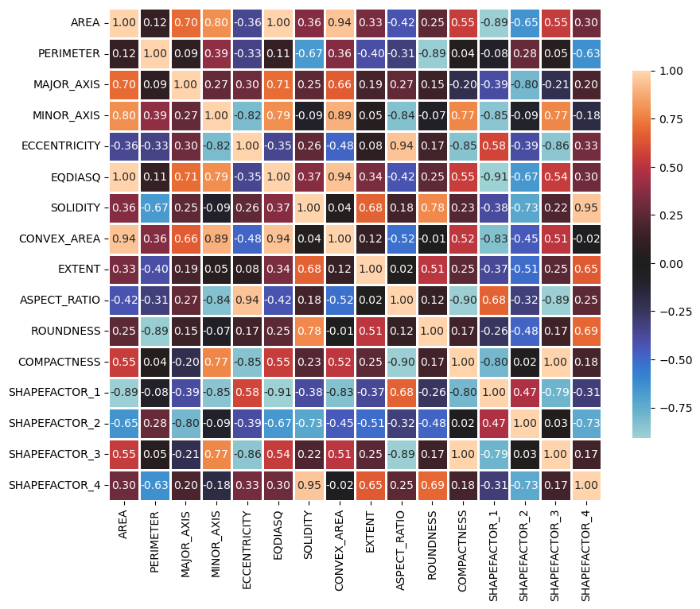
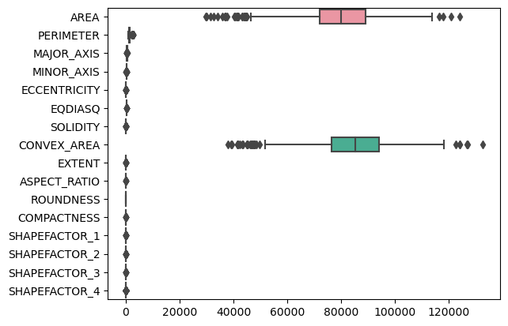
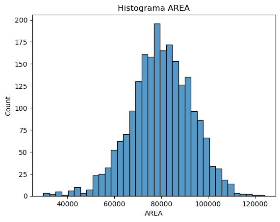
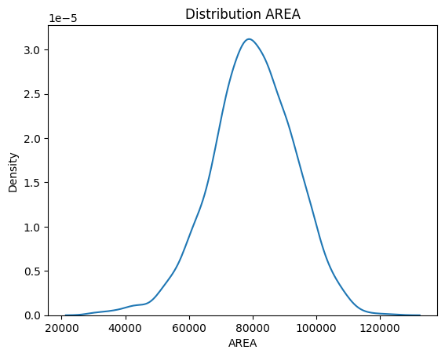
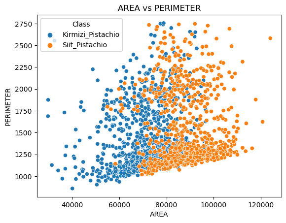
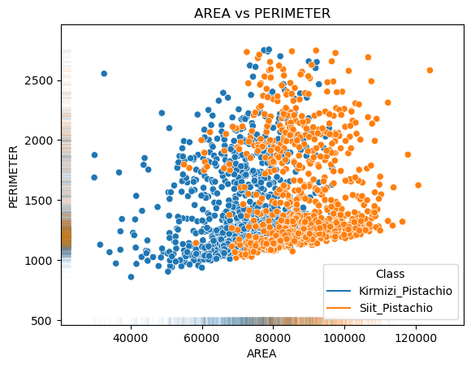
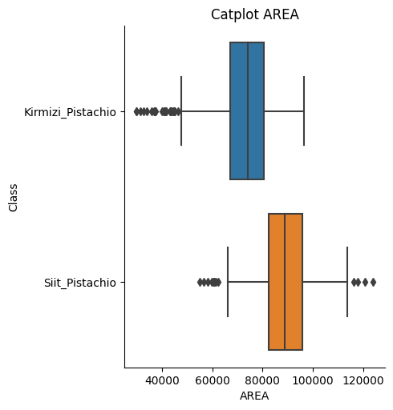
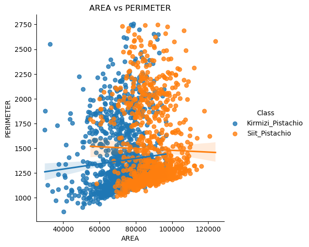
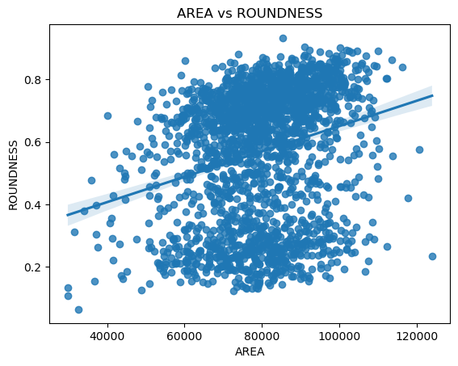

# Pistachio DataBase Exploration
The purpose of this project is to examine a database of pistachios using data visualization techniques.

## Database
The database was obtained from [muratkoklu datasets](https://www.muratkoklu.com/datasets/). It has 12 morphological and 4 shape features described in the following table:

| Attribute         | Description or Equation  |
| :-                | :-                       |
| AREA (A)          | $A = \sum_{r,c} 1$ |
| PERIMETER (P)     | It is defined as the length of its edge |
| MAJOR_AXIS (L)    | The distance between the ends of the longest line that can be drawn |
| MINOR_AXIS (I)    | The longest line that can be drawn perpendicular to the main axis |
| ECCENTRICITY (Ec) | Eccentricity of the ellipse having the same moments as the region |
| EQDIASQ (Ed)      | $Ed = \sqrt{\frac{4*A}{\pi}}$ |
| SOLIDITY (S)      | $S = \frac{A}{C}$ |
| CONVEX_AREA (C)   | Number of pixels of the smallest convex polygon that can contain the pistachio area |
| EXTENT (Ex)       | $Ex = \frac{A}{A_B}$, where $A_B$ = Area of the bounding rectangle |
| ASPECT_RATIO (K)  | $K = \frac{L}{l}$ |
| ROUNDNESS (R)     | $R = \frac{4 \pi A}{P^2}$ |
| COMPACTNESS (CO)  | $CO = \frac{Ed}{L}$ |
| SHAPEFACTOR_1 (SF1) | $SF1 = \frac{L}{A} $ |
| SHAPEFACTOR_2 (SF2) | $SF2 = \frac{l}{A}$ |
| SHAPEFACTOR_3 (SF3) | $SF3 = \frac{A}{\frac{L}{2} * \frac{L}{2} * \pi }$ |
| SHAPEFACTOR_4 (SF4) |  $SF4 = \frac{A}{\frac{L}{2} * \frac{l}{2} * \pi }$ |

The morphological characteristics of pistachio is shown in the following figure.


## Analize data

To analyze the information contained in the database, first do the following:
- Examine the number of instances and attributes
- Determine the type of data
- Check for missing data
- Evaluate the class balance
- Identify any outlier data
- Calculate the minimum, maximum, mean, and standard deviation
- Determine the distribution type

### Import the database and libraries

```python
import pandas as pd
import numpy as np
import seaborn as sns
import matplotlib.pyplot as plt

directory = './Datasets/Pistachio_16_Features_Dataset.csv'
data = pd.read_csv(directory, delimiter=",")
```

> [!TIP]
> Store the attribute name in one list and the desition attribute in another list

```python
nom_col = list(data.columns)
categories = nom_col[-1]
nom_col = nom_col[:-1]
```

### Examine number of instances and attributes of the database

In a database, instances refer to the rows of the database, while attributes are equivalent to the columns of the database.

```python
num_inst = data.shape[0]
num_atri = data.shape[1]

print("Instances:", num_inst)
print("Attributes:", num_atri)
```

Instances: 2148 <br>
Attributes: 17

### Determine the type of data by attribute

The data contained in a database can be of different types, including integers, floats, characters, among others.

```python
data.dtypes
```
AREA               int64 <br>
PERIMETER        float64 <br>
MAJOR_AXIS       float64 <br>
MINOR_AXIS       float64 <br>
ECCENTRICITY     float64 <br>
EQDIASQ          float64 <br>
SOLIDITY         float64 <br>
CONVEX_AREA        int64 <br>
EXTENT           float64 <br> 
ASPECT_RATIO     float64 <br>
ROUNDNESS        float64 <br>
COMPACTNESS      float64 <br>
SHAPEFACTOR_1    float64 <br>
SHAPEFACTOR_2    float64 <br>
SHAPEFACTOR_3    float64 <br>
SHAPEFACTOR_4    float64 <br>
Class             object <br>
dtype: object

### Check for missing data (empty spaces)

Missing data can occur for different reasons, such as capture error, irregularities in the measuring equipment, among others.

```python
data.isnull().sum()
```
AREA             0 <br>
PERIMETER        0 <br>
MAJOR_AXIS       0 <br>
MINOR_AXIS       0 <br>
ECCENTRICITY     0 <br>
EQDIASQ          0 <br>
SOLIDITY         0 <br>
CONVEX_AREA      0 <br>
EXTENT           0 <br>
ASPECT_RATIO     0 <br>
ROUNDNESS        0 <br>
COMPACTNESS      0 <br>
SHAPEFACTOR_1    0 <br>
SHAPEFACTOR_2    0 <br>
SHAPEFACTOR_3    0 <br>
SHAPEFACTOR_4    0 <br>
Class            0 <br>
dtype: int64

### Evaluate the class balance

The balance between the classes can be determined by comparing the number of instances per class.

```python
class_balance = data['Class'].value_counts()

num_kirmizi = class_balance.iloc[0]
num_siit = class_balance.iloc[1]

print('Kirmizi_Pistachio:', num_kirmizi, ', Percentage = {:.2f}'.format(num_kirmizi/num_inst*100),'%')
print('Siit_Pistachio:', num_siit, ', Percentage = {:.2f}'.format(num_siit/num_inst*100),'%')
```

Kirmizi_Pistachio: 1232 , Percentage = 57.36 % <br>
Siit_Pistachio: 916 , Percentage = 42.64 %

### Identify any outlier data 

This method consists of calculating the first and third quartiles, calculating the inter quantile range (IQR) and the lower and upper limits. <br>

To calculate the quartiles, we use the quartile function of the pandas library, the IQR is the difference between quartile 3 (Q3) and quartile 1 (Q1): $$IQR = Q3-Q1$$ the lower limit is calculated as $$Linf = Q1 - (1.5 * IQR)$$ while the upper limit is calculated as $$Lsup = Q3 + (1.5 * IQR)$$.

```python
def outliers_list(A):
    # Create index
    index = np.arange(0,A.shape[0])
    # Create empty list to add outlier data
    errors = []
    # try/except to avoid non-numeric data types
    try:
        # Define the first quartile (25%)
        Q1 = A.quantile(0.25)
        # Define the third quartile (75%)
        Q3 = A.quantile(0.75)
        # Calculate IQR
        IQR = Q3-Q1
        # Calculate limits
        limite_inf = Q1 - (1.5*IQR)
        limite_sup = Q3 + (1.5*IQR)
        # Look for outliers
        for ind in index:
            if A[ind] < limite_inf or A[ind] > limite_sup:
                # Add outlier to error list
                errors.append(str(ind)+':'+str(A[ind]))
    except Exception as e:
        print('Invalid data type\n Must be numeric')
        print(e.__class__.__name__, e)
    return errors
```
```python
outliers = []

for col in nom_col:
    list_outliers = outliers_list(data[col])
    print('Outliers in ', col, ':', len(list_outliers))
    outliers.append(len(list_outliers))
```

Outliers in  AREA : 31 <br>
Outliers in  PERIMETER : 82 <br>
Outliers in  MAJOR_AXIS : 33 <br>
Outliers in  MINOR_AXIS : 38 <br>
Outliers in  ECCENTRICITY : 75 <br>
Outliers in  EQDIASQ : 36 <br>
Outliers in  SOLIDITY : 87 <br>
Outliers in  CONVEX_AREA : 28 <br>
Outliers in  EXTENT : 52 <br>
Outliers in  ASPECT_RATIO : 17 <br>
Outliers in  ROUNDNESS : 0 <br>
Outliers in  COMPACTNESS : 25 <br>
Outliers in  SHAPEFACTOR_1 : 55 <br>
Outliers in  SHAPEFACTOR_2 : 60 <br>
Outliers in  SHAPEFACTOR_3 : 35 <br>
Outliers in  SHAPEFACTOR_4 : 167

### Calculate the minimum, maximum, mean, and standard deviation

In continuous data there are characteristics that describe the central tendency of the data such as its mean and standard deviation. In addition, the minimum and maximum values are used to understand the range in which each characteristic of the data is found.

```python
data.describe().transpose()
```

<div>
<table border="1" class="dataframe">
  <thead>
    <tr style="text-align: right;">
      <th></th>
      <th>count</th>
      <th>mean</th>
      <th>std</th>
      <th>min</th>
      <th>25%</th>
      <th>50%</th>
      <th>75%</th>
      <th>max</th>
    </tr>
  </thead>
  <tbody>
    <tr>
      <th>AREA</th>
      <td>2148.0</td>
      <td>79950.655493</td>
      <td>13121.737799</td>
      <td>29808.0000</td>
      <td>71936.750000</td>
      <td>79905.50000</td>
      <td>89030.500000</td>
      <td>124008.0000</td>
    </tr>
    <tr>
      <th>PERIMETER</th>
      <td>2148.0</td>
      <td>1425.971751</td>
      <td>375.565503</td>
      <td>858.3630</td>
      <td>1170.996250</td>
      <td>1262.78550</td>
      <td>1607.906250</td>
      <td>2755.0491</td>
    </tr>
    <tr>
      <th>MAJOR_AXIS</th>
      <td>2148.0</td>
      <td>446.248968</td>
      <td>32.445304</td>
      <td>320.3445</td>
      <td>426.508750</td>
      <td>448.57475</td>
      <td>468.509400</td>
      <td>541.9661</td>
    </tr>
    <tr>
      <th>MINOR_AXIS</th>
      <td>2148.0</td>
      <td>238.311842</td>
      <td>30.310695</td>
      <td>133.5096</td>
      <td>217.875825</td>
      <td>236.41635</td>
      <td>257.760150</td>
      <td>383.0461</td>
    </tr>
    <tr>
      <th>ECCENTRICITY</th>
      <td>2148.0</td>
      <td>0.840219</td>
      <td>0.048759</td>
      <td>0.5049</td>
      <td>0.817500</td>
      <td>0.84965</td>
      <td>0.875200</td>
      <td>0.9460</td>
    </tr>
    <tr>
      <th>EQDIASQ</th>
      <td>2148.0</td>
      <td>317.919173</td>
      <td>26.908600</td>
      <td>194.8146</td>
      <td>302.642850</td>
      <td>318.96530</td>
      <td>336.685525</td>
      <td>397.3561</td>
    </tr>
    <tr>
      <th>SOLIDITY</th>
      <td>2148.0</td>
      <td>0.940093</td>
      <td>0.050452</td>
      <td>0.5880</td>
      <td>0.919850</td>
      <td>0.95415</td>
      <td>0.976925</td>
      <td>0.9951</td>
    </tr>
    <tr>
      <th>CONVEX_AREA</th>
      <td>2148.0</td>
      <td>85015.839851</td>
      <td>13154.919327</td>
      <td>37935.0000</td>
      <td>76467.000000</td>
      <td>85075.50000</td>
      <td>93893.500000</td>
      <td>132478.0000</td>
    </tr>
    <tr>
      <th>EXTENT</th>
      <td>2148.0</td>
      <td>0.716067</td>
      <td>0.052532</td>
      <td>0.4272</td>
      <td>0.687000</td>
      <td>0.72650</td>
      <td>0.753600</td>
      <td>0.8204</td>
    </tr>
    <tr>
      <th>ASPECT_RATIO</th>
      <td>2148.0</td>
      <td>1.898154</td>
      <td>0.240100</td>
      <td>1.1585</td>
      <td>1.736375</td>
      <td>1.89625</td>
      <td>2.067025</td>
      <td>3.0858</td>
    </tr>
    <tr>
      <th>ROUNDNESS</th>
      <td>2148.0</td>
      <td>0.569172</td>
      <td>0.212760</td>
      <td>0.0628</td>
      <td>0.371250</td>
      <td>0.64340</td>
      <td>0.744125</td>
      <td>0.9336</td>
    </tr>
    <tr>
      <th>COMPACTNESS</th>
      <td>2148.0</td>
      <td>0.713077</td>
      <td>0.044547</td>
      <td>0.4760</td>
      <td>0.681550</td>
      <td>0.71070</td>
      <td>0.741650</td>
      <td>0.8779</td>
    </tr>
    <tr>
      <th>SHAPEFACTOR_1</th>
      <td>2148.0</td>
      <td>0.005701</td>
      <td>0.000817</td>
      <td>0.0040</td>
      <td>0.005200</td>
      <td>0.00560</td>
      <td>0.006100</td>
      <td>0.0131</td>
    </tr>
    <tr>
      <th>SHAPEFACTOR_2</th>
      <td>2148.0</td>
      <td>0.003017</td>
      <td>0.000340</td>
      <td>0.0024</td>
      <td>0.002800</td>
      <td>0.00300</td>
      <td>0.003200</td>
      <td>0.0053</td>
    </tr>
    <tr>
      <th>SHAPEFACTOR_3</th>
      <td>2148.0</td>
      <td>0.510461</td>
      <td>0.063942</td>
      <td>0.2266</td>
      <td>0.464475</td>
      <td>0.50515</td>
      <td>0.550075</td>
      <td>0.7706</td>
    </tr>
    <tr>
      <th>SHAPEFACTOR_4</th>
      <td>2148.0</td>
      <td>0.955239</td>
      <td>0.051840</td>
      <td>0.6204</td>
      <td>0.944000</td>
      <td>0.97310</td>
      <td>0.987300</td>
      <td>0.9990</td>
    </tr>
  </tbody>
</table>
</div>

### Determine the distribution type by attribute and class

There are different types of data distribution:
- Uniform
- Normal (unimodal)
- Unimodal left or right skewed
- Multimodal
- Exponential

```python
for col in nom_col:
    sns.displot(data=data,x=col, kind="kde")
    plt.title('Distribution ' + col)
    plt.show()

    sns.displot(data=data, x=col, hue='Class', kind="kde")
    plt.title('Distribution ' + col)
    plt.show()
```
An example of the AREA distribution of all instances and divided per class are shown in the following figures.


## Data Visualization

Data visualization is use to represent the information in a simple way.

### Heatmap

This represents the data as a color-coded matrix. For this, the correlations were stored in a DataFrame, using the `.corr` function of pandas.

```python
correlation = data[nom_col].corr()
fig, ax = plt.subplots(figsize=(10,10))
sns.heatmap(correlation, vmax=1.0, center=0, fmt='.2f', square=True, linewidths=1, annot=True, cbar_kws={"shrink": .60})
plt.show()
```
Heatmap of all attributes is shown in the following figure.



### Boxplot

A box plot shows the distribution of quantitative data in a way that facilitates comparisons between variables.

Boxplot of all attributes is shown in the following figure.



### Histogram

A histogram is a classic visualization tool that represents the distribution of one or more variables by counting the number of observations.

Histogram of the attribute AREA is shown in the following figure.



### Kdplot

Kdeplot is a density estimation plot, which is a method for visualizing the distribution.

Kdeplot graphic of the attribute AREA is shown in the following figure.



### Displot

Displot is another method of visualizing the distribution.

Displot graphic of the attribute AREA is shown in the following figure.


### Scatter

The scatter plot allows to visualize the relationship between two attributes.

The scatter plot between the attributes AREA and PERIMETER is shown in the following figure.



### Rugplot

This function is intended to complement other graphs by showing the location of individual observations in a discrete manner. 

The Rugplot between the attributes AREA and PERIMETER is shown in the following figure.



### Catplot

This function provides access to several axis-level functions that show the relationship between a numeric variable and one or more categorical variables.

Catplot graphic of the attribute AREA is shown in the following figure.



### lmplot

It is intended as a practical interface for fitting regression models on conditional subsets of a data set. 

The lmplot between the attributes AREA and PERIMETER is shown in the following figure.



### Regplot

Graphically represent the data and the fit of a linear regression model.

The Regplot between the attributes AREA and PERIMETER is shown in the following figure.


