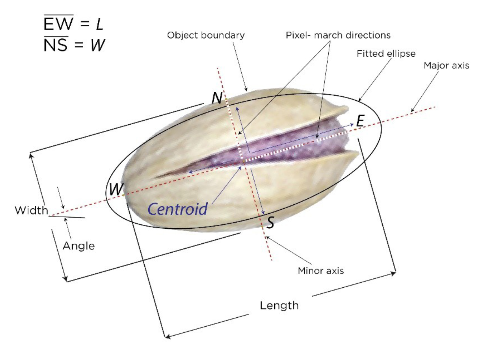

## Pistachio DataBase Exploration
The purpose of this project is to examine a database of pistachios utilizing techniques of visualization, normalization, and generation of synthetic data.

### Database
The database was obtained from [muratkoklu datasets](https://www.muratkoklu.com/datasets/). It has 12 morphological and 4 shape features described in the following table:

| Attribute         | Description or Equation  |
| :-                | :-                       |
| AREA (A)          | $A = \sum_{r,c} 1$ |
| PERIMETER (P)     | It is defined as the length of its edge |
| MAJOR_AXIS (L)    | The distance between the ends of the longest line that can be drawn |
| MINOR_AXIS (I)    | The longest line that can be drawn perpendicular to the main axis |
| ECCENTRICITY (Ec) | Eccentricity of the ellipse having the same moments as the region |
| EQDIASQ (Ed)      | $Ed = \sqrt{\frac{4*A}{\pi}}$ |
| SOLIDITY (S)      | $S = \frac{A}{C}$ |
| CONVEX_AREA (C)   | Number of pixels of the smallest convex polygon that can contain the pistachio area |
| EXTENT (Ex)       | $Ex = \frac{A}{A_B}$, where $A_B$ = Area of the bounding rectangle |
| ASPECT_RATIO (K)  | $K = \frac{L}{l}$ |
| ROUNDNESS (R)     | $R = \frac{4 \pi A}{P^2}$ |
| COMPACTNESS (CO)  | $CO = \frac{Ed}{L}$ |
| SHAPEFACTOR_1 (SF1) | $SF1 = \frac{L}{A} $ |
| SHAPEFACTOR_2 (SF2) | $SF2 = \frac{l}{A}$ |
| SHAPEFACTOR_3 (SF3) | $SF3 = \frac{A}{\frac{L}{2} * \frac{L}{2} * \pi }$ |
| SHAPEFACTOR_4 (SF4) |  $SF4 = \frac{A}{\frac{L}{2} * \frac{l}{2} * \pi }$ |

The morphological characteristics of pistachio is shown in the following figure.

