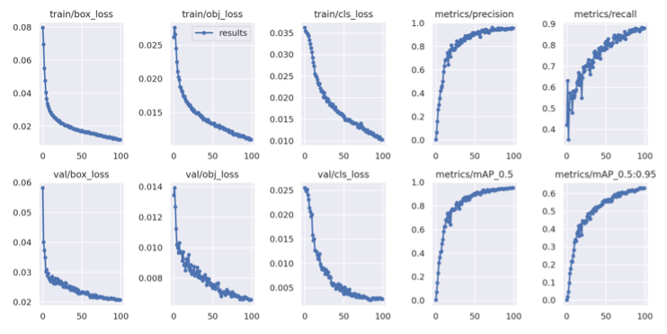
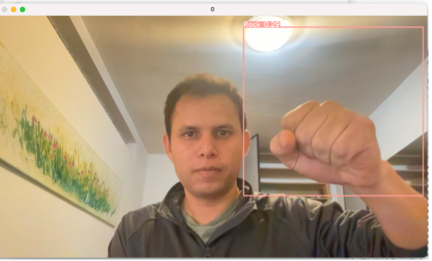
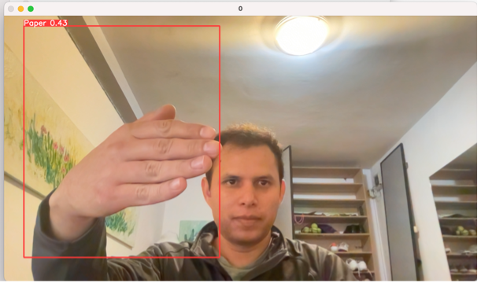
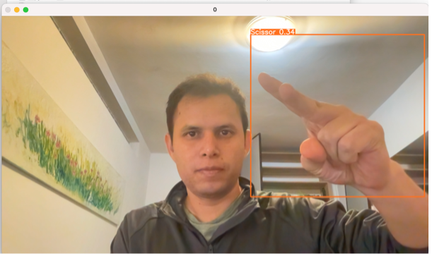

# Rock, Paper, Scissors Object detection
In this project we use Object detection in the game rock, paper, scissors.

## Object detection
The detection of objects in images involves not only identifying what type of object it is, but also locating it within the image (obtaining the coordinates of the 'containing box'). In other words, detection = classification + localization.

## YOLO
In 2016 model YOLO was created, a network that stands for 'You Only Look Once'. This network makes a single pass to the convolutional neural network to detect objects, and distinguishes itself from its competitors because, as the name implies, it requires viewing the image only once, which allows it to be the fastest of all. This speed allows it to easily detect objects in real time in videos up to 30 FPS.

To perform the detection it first divides the image into an SxS grid. In each of the cells it predicts N possible 'bounding boxes' and calculates the level of certainty (probability) of each of them, i.e. it calculates SxSxN different boxes, most of them with a very low level of certainty. After obtaining these predictions, it proceeds to eliminate the boxes that are below a limit. A 'non-max-suppression' step is applied to the remaining boxes, which serves to eliminate possible objects that were detected in duplicate and thus leave only the most accurate of them.

In the present work, the Yolov5 model was used for object localization and recognition.

## mAP (Mean Average Precision)
mAP is metric for image detection that allows to evaluate if the object class and the position of the bounding box (X, Y, height and width) are good at the same time.

$map = \frac{1}{|classes|} \sum_{c \in classes}\frac{\text{Number of TP}(c)}{\text{Number of TP}(c) + \text{Number of FP}(c)}$

## Database
A fundamental part of YOLO training is to know the format of how to represent the information in each of the different versions of the model. The model implemented for this work was YOLOv5.

We used the "Rock-Paper-Scissors 3" database obtained from the roboflow platform [1], which contains 9,225 images of the rock-paper-scissors game in RGB format. Also, provides us with a text file containing a bounding box annotation for each of the objects in the image, represented in the following format.

(object-class-ID) (X center) (Y center) (Box width) (Box height)

The configurations for training are divided into three YAML files, which are provided when downloading the database.

1. Data configuration file: describes the parameters of the dataset. For example, it provides the paths to the training, validation and test datasets, and the number of classes.
2. Model configuration: describes the model architecture. The selected model architecture supports training images with 640x640 images. This file is located in the 'models' directory. When the training is initialized from pre-trained weights, it is not necessary to edit the model configuration file as the model will be extracted from with the pre-trained weights.
3. Hyperparameters configuration: define the hyperparameters for training, including learning rate, losses, etc. It is recommended to start training with the default hyperparameters to establish a baseline performance.

## Training
The object detector is based on the yolov5 model. For the training of this model, the images obtained from the database that were previously labeled were used.

The training is induced by the following command:
```
!python train.py --img 416 --batch 16 --epochs 100 --data {dataset.location}/data.yaml --weights yolov5s.pt --name yolov5s_results --cache
```

Indicating the following hyperparameters:
- Batch: 16.
- Epochs: 100.
- Data: path to the data configuration file.
- Weights: path to the file with the pre-trained weights.
- Img: Image size in pixels (416).
- Cache: Cache images for fast training.

## Evaluation
The command used to evaluate the test images was as follows:

```
!python detect.py --weights runs/yolov5s_results/weights/best.pt -- img 416 --conf 0.2 --source {dataset.location}/valid/images
```

- Weights: the path of the weights that were obtained in the training.
- Img: image size.
- Conf: the confidence threshold for detection.
- Source: the file path of the test images that the model has not seen.
  
In the present work the validation images were tested, as well as new images and a video by means of a webcam.

## Results
The training results are summarized in the next table.

| Class | Instances | Precision | Recall | mAP |
| :- | :- | :- | :- | :- |
| All | 2905 | 0.953 | 0.876 | 0.949 |
| Rock | 1069 | 0.964 | 0.856 | 0.954 |
| Paper | 1088 | 0.941 | 0.861 | 0.937 |
| Scissors | 748 | 0.950 | 0.910 | 0.958 |

Accuracy, loss and mAP plots of the model are shown in the following figure.



To better understand the results, let us summarize the losses and metrics obtained from the YOLOv5 model.
and metrics obtained from the YOLOv5 model.

The YOLO loss function is composed of three parts:
1. Box_loss: loss due to regression of the bounding box (mean square error).
2. Obj_loss: the confidence of the presence of the object (Binary Cross Entropy).
3. Cls_loss: the classification loss.

'precision' measures the percentage of correct predictions and 'recall' measures the proportion of true bboxes predicted correctly.

'mAP_0.5' measures the mean accuracy (mAP) at the IoU threshold of 0.5.

'mAP_0.5:0.95' is the average mAP over different IoU thresholds, ranging from 0.5 to 0.95.

Here are some examples of the object detection of the rock, pape, scissors game.

### Example of rock shape


### Example of paper shape


### Example of scissors shape


## Conclusions
The yolov5 detection model is an efficient implementation technique. Where the database "Rock- Paper-Scissors 3", has enough information that allows to have an mPA value of 95% during the model training.

Moreover, during the tests it is observed that a white background helps to increase the confidence value of the detected objects.

## References
[1] Rock Paper Scissors 3, Rock-Paper-Scissors 3 Dataset. Roboflow, 2022. [Online]. Available: https://https://universe.roboflow.com/joseph-nelson/rock-paper- scissors. <br>
[2] P. D. Lihi Gur Arie, “The Practical Guide for Object Detection with Yolov5 algorithm,” Medium, 01-Apr-2022. [Online]. Available: https://towardsdatascience.com/the-practical-guide-for-object- detection-with-yolov5-algorithm-74c04aac4843.
