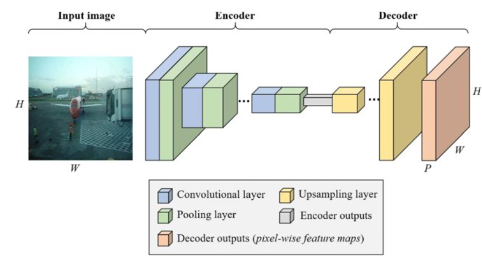
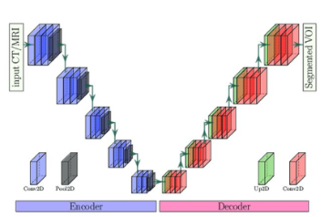

# Tenis segmentation
In this project we use segmentation models to identify tennis players.

## Semantic segmentation
Semantic segmentation is a technique that allows associating each pixel of an image with a class label. It is also considered an image classification task at pixel level differentiating the objects in an image.

Semantic segmentation aims to extract features and using them to identify the different categories in an image.

The steps are as follows:
- Analyze the training set to classify a specific object in the image.
- Create a semantic segmentation network to analyze the objects and draw a bounding box around them.
- Train the semantic segmentation network to group the pixels in a localized image by creating a segmentation mask.

## Segmentation by Instances
Instance segmentation deals with detecting and delimiting each distinct instance of an object that appears in an image. Instance segmentation detects all instances of a class with an additional functionality of delimiting separate instances of any segment class. The segmentation by instances creates a map of segments for each category and instance of that class.

Instance segmentation involves identifying object boundaries at the detailed pixel level, which makes it a complex task to perform. 

This model contains two significant parts:
- Object detection
- Sentence segmentation

The following figure shows an example of semantic segmentation and segmentation by instances.

## Database
The database consists of images with JPEG extension, which were extracted from tennis games in a television broadcast. 938 images were collected and data augmentation was applied to them for training to add up to 3339 in total. 

These images were manually segmented into 2 categories: tennis player and tennis ball, as shown in the next figure.

## Encoder-Decoder
An encoder is a part of a neural network that is responsible for processing and compressing the input information. Compression is performed by reducing the dimensionality of the information, i.e. some features of the original information are removed. The goal is to generate a compact representation of the information that can be used for a specific task.

On the other hand, a decoder is a part of a neural network that is responsible for retrieving the information compressed by the encoder. The goal is to generate a detailed representation of the original information from the compressed representation. The decoder uses the compressed information to reconstruct the original information as accurately as possible.

Together, the encoder and decoder form a neural network architecture called autoencoder, which is used for information compression and reconstruction tasks. It is common to use this architecture for unsupervised learning tasks, where no training labels are available.

## FCN_8 model
FCN-8 is a neural network architecture for image segmentation tasks, developed in 2015. It is an extension of the traditional neural network architecture, Fully Convolutional Network (FCN).
The main difference between FCN-8 and traditional neural networks is that FCN-8 has an encoder-decoder structure, where the encoder reduces the spatial resolution of the image as the network depth is increased and the decoder increases the resolution again. FCN-8 uses upsampling and skip connections techniques to recover the information lost in the compression process, allowing the network to generate a detailed representation of the image. FCN-8 has been successfully used in various image segmentation tasks, including object segmentation and multi-class segmentation. It is a popular architecture in the computer vision research community.

## VGG_16 segnet model
VGG-16 is a neural network architecture developed for image classification tasks. It was introduced in 2014, it is a deeper version of the VGG architecture. It is a Convolutional Neural Network (CNN) type neural network based on the idea of using several layers of 3x3 filters to extract image features. By using several layers of filters, VGG- 16 can learn increasingly complex features as you go deeper into the network.

Although originally developed for classification tasks, VGG-16 has also been used in image segmentation tasks by adding additional layers to generate segmentation masks.

## VGG_Unet Model
VGG-Unet is a variant of the U-Net architecture, which combines the features of VGG networks with those of U-Net. It is a neural network architecture developed for image segmentation tasks. The VGG-Unet architecture uses the encoder-decoder structure of U-Net, but uses the VGG layers as the encoder instead of using ordinary convolution layers. This allows the network to learn more complex and detailed features from the input image. In addition, VGG-Unet uses "skip" connections between the encoder and decoder layers to allow propagation of detailed information through all layers of the network. VGG-Unet has been shown to perform well in image segmentation tasks, especially in medical and satellite image segmentation tasks.

## YOLOv8 Model
YOLOv8 is a neural network architecture developed for object detection tasks in images. YOLO (You Only Look Once) is an object detection approach that consists of dividing the image into small boxes and using a neural network to classify each box as containing or not containing a specific object.

YOLOv8 is a newer version of the YOLO architecture, which has been improved in terms of accuracy and processing speed. Although YOLOv8 was developed for object detection tasks, it has also been used for image segmentation, by generating segmentation masks from detection boxes. However, YOLOv8 is not a specific model for segmentation, but has been used as a basis for developing other architectures for segmentation, as it is a very powerful and well-established neural network in the computer vision research community.

## Traning
The training of the models is describe in the following table:

| Model | Input shape | Ephocs | Accuracy |
| :- | :- | :- | :- |
| FCN_8 | 640x640 | 5 | 99.55% |
| VGG_16_segnet | 640x640 | 5 | 99.53% |
| VGG_Unet | 640x640 | 5 | 99.65% |
| YOLOv8 | 640x640 | 50 | 42.60% |

## Evaluation
The evaluation metric used is the mean Intersection over Union (IOU).

## Results
The results of the models are summarized in the following table.

| Model | Ball IOU | Player IOU | Background IOU |
| :- | :- | :- | :- |
| FCN_8 | 0 | 0.5859 | 0.995 |
| VGG_16_segnet | 0 | 0.5215 | 0.9945 |
| VGG_Unet | 0.13085 | 0.60 | 0.9955 |

Example of FNC_8 model

Example of VGG_16 model

Example of VGG_unet model

Example of YOLOv8 model

## Conclusion
It was possible to observe the operation of a semantic and instance segmentation models. Subsequently, it was possible to observe how the models found it more difficult to segment such small objects, it is believed that this may be due to the size of the image by lowering the resolution to 640x640. In addition, it was necessary to increase the number of epochs to train, although the computational capacity is not enough to perform this task quickly.

The model based on Unet was the one that obtained the better results, this is due to the fact that it is the most specialized model for this type of segmentation problems being this applied in semantic segmentation. It is also considered that the number of images should have been increased to improve the accuracy as well as to include other environments and game situations in which the players may not be appreciated so well or are in atypical positions of the game.

## References
[1] C. Silva, “Modelamiento Semántico del Entorno de un Robot utilizando información RGB-D”, 2016. doi: 10.13140/RG.2.2.28418.17609. 
[2] O. A. Soto-Orozco, A. D. Corral-Sáenz, C. E. Rojo- González, y J. A. Ramírez-Quintana, “Análisis del desempeño de redes neuronales profundas para segmentación semántica en hardware limitado”, ReCIBE. Revista electrónica de Computación, Informática, Biomédica y Electrónica, vol. 8, núm. 2, pp. 1–21, 2019. 
[3] D. Iglesias, “Segmentación de Imágenes con Redes Convolucionales”, el 18 de abril de 2021. https://www.iartificial.net/segmentacion-imagenes-redes- convolucionales/ (consultado el 18 de enero de 2023). 
[4] A. Gómez, F. León-Pérez, M. Plazas-Wadynski, y F. Martínez-Carrilo, “Segmentación multinivel de patrones de Gleason usando representaciones convolucionales en imágenes histopatológicas”, TecnoLógicas, vol. 24, p. e2132, dic. 2021, doi: 10.22430/22565337.2132. 
[5] D. M. Woerdemann, “Segmentación de instancias simplificada de células y núcleos mediante el aprendizaje profundo”. https://www.olympus- lifescience.com/es/discovery/instance-segmentation-of- cells-and-nuclei-made-simple-using-deep-learning/ (consultado el 18 de enero de 2023). 
[6] A. Dertat, “Applied Deep Learning - Part 3: Autoencoders”, Medium, el 8 de octubre de 2017. https://towardsdatascience.com/applied-deep-learning-part- 3-autoencoders-1c083af4d798 (consultado el 18 de enero de 2023). 
[7] S. Piramanayagam, E. Saber, W. Schwartzkopf, y F. Koehler, “Supervised Classification of Multisensor Remotely Sensed Images Using a Deep Learning Framework”, Remote Sensing, vol. 10, p. 1429, sep. 2018, doi: 10.3390/rs10091429. 
[8] A. Kebir, M. Taibi, y F. Serradilla, “Compressed VGG16 Auto-Encoder for Road Segmentation from Aerial Images with Few Data Training”. 
[9] T. Ghosh, Md. K. Hasan, S. Roy, Md. A. Alam, E. Hossain, y M. Ahmad, Multi-class probabilistic atlas-based whole heart segmentation method in cardiac CT and MRI. 2021. 
[10] “Segmentation - Ultralytics YOLOv8 Docs”. https://docs.ultralytics.com/tasks/segmentation/ (consultado el 17 de enero de 2023). 
[11] “Evaluación de calidad en la segmentación de imágenes - PDF Descargar libre”. https://docplayer.es/10131855- Evaluacion-de-calidad-en-la-segmentacion-de- imagenes.html (consultado el 17 de enero de 2023).

